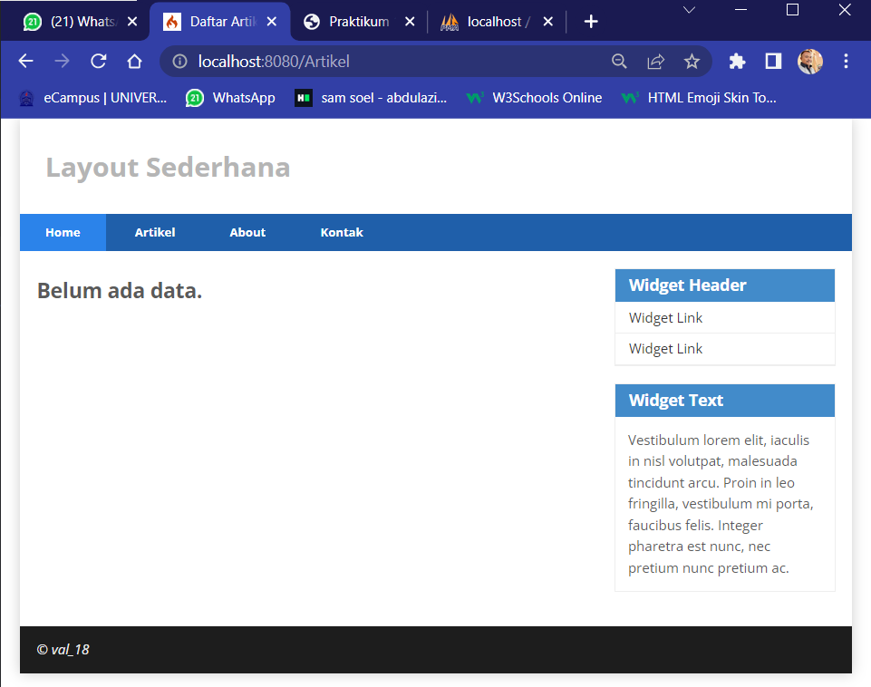
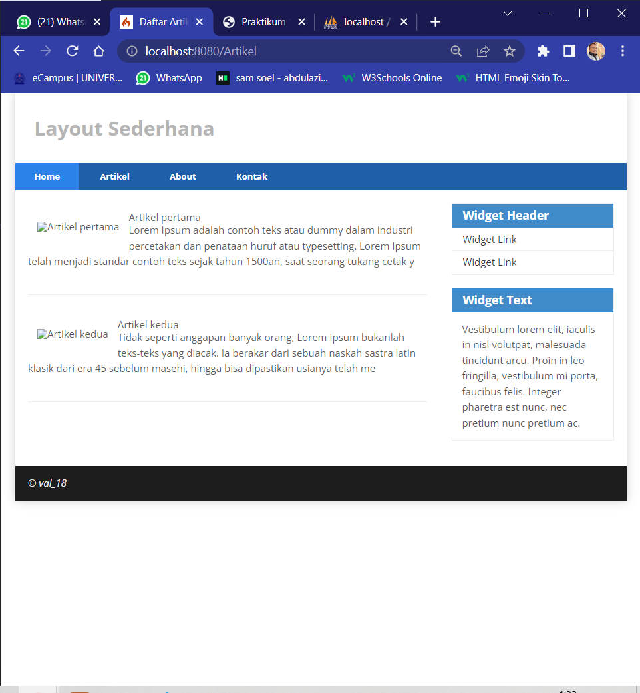
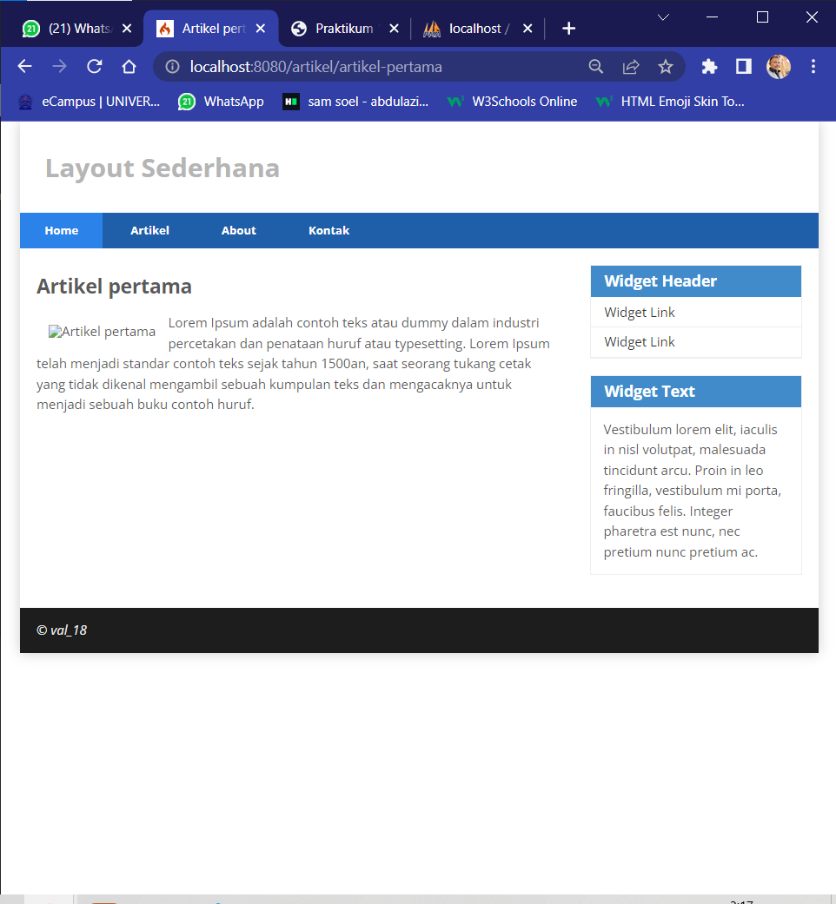
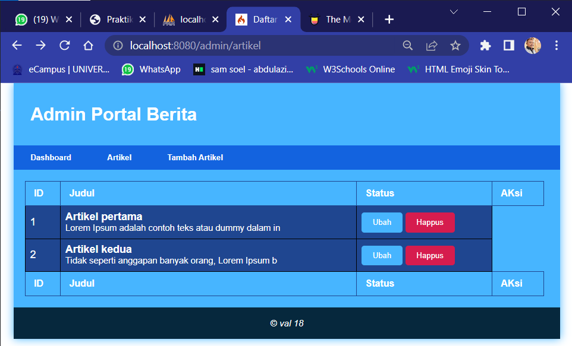
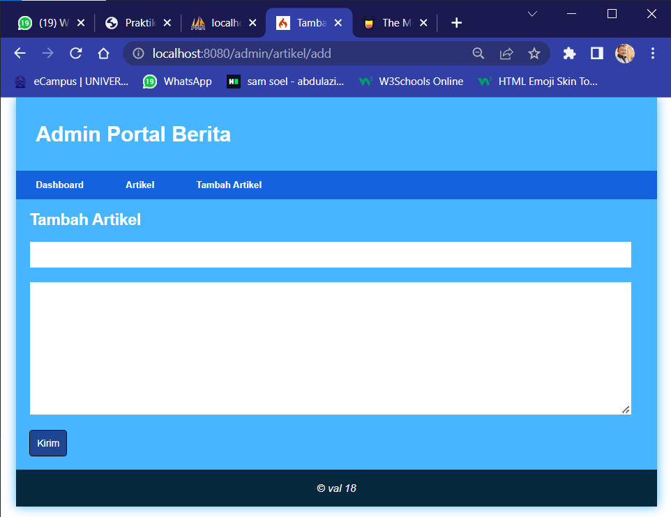
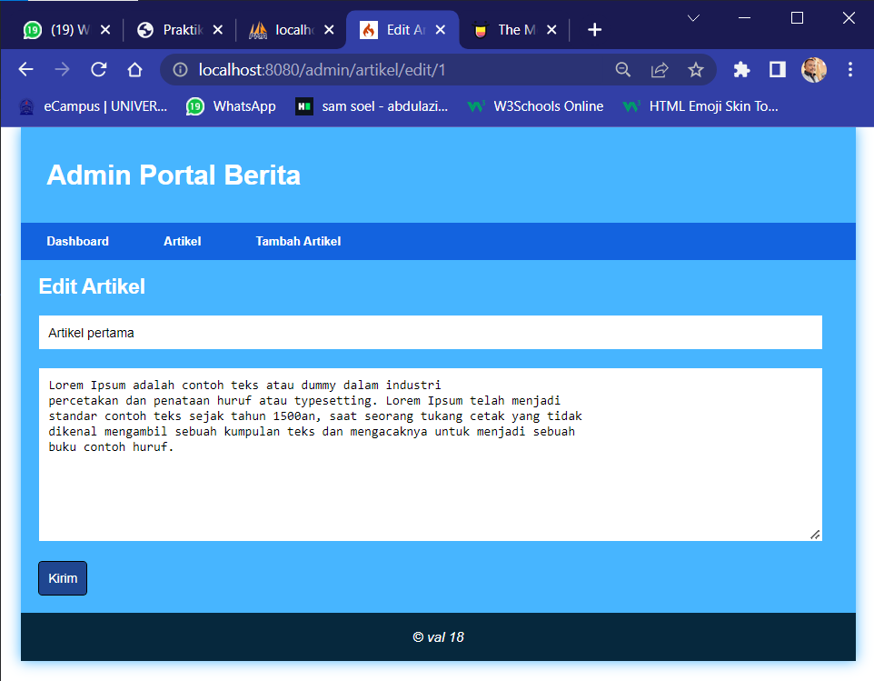

# Praktikum 12: Framework Lanjutan (CRUD)

## Membuat Database: Studi Kasus Data Artikel

## <u>Membuat Database</u>

`CREATE DATABASE lab_ci4;`

## <u>Membuat Tabel</u>

`CREATE TABLE artikel ( id INT(11) auto_increment, judul VARCHAR(200) NOT NULL, isi TEXT, gambar VARCHAR(200), status TINYINT(1) DEFAULT 0, slug VARCHAR(200), PRIMARY KEY(id) );`

## Konfigurasi koneksi database

Selanjutnya membuat konfigurasi untuk menghubungkan dengan database server.
Konfigurasi dapat dilakukan dengan du acara, yaitu pada file **app/config/database.php**
atau menggunakan file **.env**. Pada praktikum ini kita gunakan konfigurasi pada file .env, dengan menghilangkan **#** seperti berikut.


## Membuat Model

Selanjutnya adalah membuat Model untuk memproses data Artikel. Buat file baru pada
direktori **app/Models** dengan nama **ArtikelModel.php**

```php
<?php
namespace App\Models;
use CodeIgniter\Model;
class ArtikelModel extends Model
{
protected $table = 'artikel';
protected $primaryKey = 'id';
protected $useAutoIncrement = true;
protected $allowedFields = ['judul', 'isi', 'status', 'slug', 'gambar'];
}
```

## Membuat Controller

Buat Controller baru dengan nama **Artikel.php** pada direktori **app/Controllers.**

```php
<?php
namespace App\Controllers;
use App\Models\ArtikelModel;
class Artikel extends BaseController
{
    public function index()
    {
        $title = 'Daftar Artikel';
        $model = new ArtikelModel();
        $artikel = $model->findAll();
        return view('artikel/index', compact('artikel', 'title'));
    }
}
```

## Membuat View

Buat direktori baru dengan nama **artikel** pada direktori a**pp/views**, kemudian buat file
baru dengan nama **index.php**.

```php
<?= $this->include('template/header'); ?>
<?php if ($artikel) : foreach ($artikel as $row) : ?>
        <article class="entry">
            <h2<a href="<?= base_url('/artikel/' . $row['slug']); ?>"><?=
                                                                        $row['judul']; ?></a>
                </h2>
                " alt="<?=
                                                                                $row['judul']; ?>">
                <p><?= substr($row['isi'], 0, 200); ?></p>
        </article>
        <hr class="divider" />
    <?php endforeach;
else : ?>
    <article class="entry">
        <h2>Belum ada data.</h2>
    </article>
<?php endif; ?>
<?= $this->include('template/footer'); ?>
```



Belum ada data yang diampilkan. Kemudian coba tambahkan beberapa data pada
database agar dapat ditampilkan datanya.

`INSERT INTO artikel (judul, isi, slug) VALUE ('Artikel pertama', 'Lorem Ipsum adalah contoh teks atau dummy dalam industri percetakan dan penataan huruf atau typesetting. Lorem Ipsum telah menjadi standar contoh teks sejak tahun 1500an, saat seorang tukang cetak yang tidak dikenal mengambil sebuah kumpulan teks dan mengacaknya untuk menjadi sebuah buku contoh huruf.', 'artikel-pertama'), ('Artikel kedua', 'Tidak seperti anggapan banyak orang, Lorem Ipsum bukanlah teks-teks yang diacak. Ia berakar dari sebuah naskah sastra latin klasik dari era 45 sebelum masehi, hingga bisa dipastikan usianya telah mencapai lebih dari 2000 tahun.', 'artikel-kedua'); `
Refresh kembali browser, sehingga akan ditampilkan hasilnya.



## Membuat Tampilan Detail Artikel

Tampilan pada saat judul berita di klik maka akan diarahkan ke halaman yang berbeda.
Tambahkan fungsi baru pada **Controller Artikel** dengan nama **view()**.

```php
public function view($slug)
    {
        $model = new ArtikelModel();
        $artikel = $model->where(['slug' => $slug])->first();

        // Menampilkan error apabila data tidak ada.
        if (!$artikel)
        {
            throw PageNotFoundException::forPageNotFound();
        }
        $title = $artikel['judul'];
        return view('artikel/detail', compact('artikel', 'title'));
    }
```

## Membuat View Detail

Buat view baru untuk halaman detail dengan nama **app/views/artikel/detail.php**.

```php
<?= $this->include('template/header'); ?>
<article class="entry">
 <h2><?= $artikel['judul']; ?></h2>
 " alt="<?=
$artikel['judul']; ?>">
 <p><?= $row['isi']; ?></p>
</article>
<?= $this->include('template/footer'); ?>
```

## Membuat Routing untuk artikel detail

Buka Kembali file **app/config/Routes.php**, kemudian tambahkan routing untuk artikel detail.

```php
<?= $this->include('template/header'); ?>
<article class="entry">
 <h2><?= $artikel['judul']; ?></h2>
 " alt="<?=
$artikel['judul']; ?>">
 <p><?= $row['isi']; ?></p>
</article>
<?= $this->include('template/footer'); ?>
```

Membuat Routing untuk artikel detail
Buka Kembali file **app/config/Routes.php**, kemudian tambahkan routing untuk artikel
detail.

```php
$routes->get('/artikel/(:any)', 'Artikel::view/$1');
```



## Membuat Menu Admin

Menu admin adalah untuk proses CRUD data artikel. Buat method baru pada
**Controller Artikel** dengan nama **admin_index()**.

```php
public function admin_index()
 {
 $title = 'Daftar Artikel';
 $model = new ArtikelModel();
 $artikel = $model->findAll();
 return view('artikel/admin_index', compact('artikel', 'title'));
 }
```

## Membuat tamplate untuk admin

Buatlah file **admin_footer.php** dan **admin_header.php** di dalam direktori **app/views/template**

**admin_header.php**

```html
<!DOCTYPE html>
<html lang="en">
  <head>
    <meta charset="UTF-8" />
    <title><?= $title; ?></title>
    <link rel="stylesheet" href="<?= base_url('/admin.css'); ?>" />
  </head>

  <body>
    <div id="container">
      <header>
        <h1>Admin Portal Berita</h1>
      </header>
      <nav>
        <a href="<?= base_url('/admin/artikel'); ?>" class="active"
          >Dashboard</a
        >
        <a href="<?= base_url('/artikel'); ?>">Artikel</a>
        <a href="<?= base_url('/admin/artikel/add'); ?>">Tambah Artikel</a>
      </nav>
    </div>
  </body>
</html>
```

**admin_footer.php**

```html
<footer>
        <p>&copy; <i>val 18</i></p>
    </footer>
    </div>
</body>
</html>
```

Selanjutnya buat view untuk tampilan admin dengan nama **admin_index.php**

```html
<?= $this->include('template/admin_header'); ?>

<form method="get" class="form-search">
  <input type="text" name="q" value="<?= $q; ?>" placeholder="Cari data" />
  <input type="submit" value="Cari" class="btn btn-primary" />
</form>

<table class="table">
  <thead>
    <tr>
      <th>ID</th>
      <th>Judul</th>
      <th>Status</th>
      <th>AKsi</th>
    </tr>
  </thead>
  <tbody>
    <?php if ($artikel) : foreach ($artikel as $row) : ?>
    <tr>
      <td><?= $row['id']; ?></td>
      <td>
        <b><?= $row['judul']; ?></b>
        <p>
          <small><?= substr($row['isi'], 0, 50); ?></small>
        </p>
      </td>
      <td><?= $row['status']; ?></td>
      <td>
        <a
          class="btn"
          href="<?= base_url('/admin/artikel/edit/' .
                                                    $row['id']); ?>"
          >Ubah</a
        >
        <a
          class="btn btn-danger"
          onclick="return confirm('Yakin
menghapus data?');"
          href="<?= base_url('/admin/artikel/delete/' .
                                $row['id']); ?>"
          >Hapus</a
        >
      </td>
    </tr>
    <?php endforeach;
        else : ?>
    <tr>
      <td colspan="4">Belum ada data.</td>
    </tr>
    <?php endif; ?>
  </tbody>
  <tfoot>
    <tr>
      <th>ID</th>
      <th>Judul</th>
      <th>Status</th>
      <th>AKsi</th>
    </tr>
  </tfoot>
</table>

<?= $pager->only(['q'])->links(); ?>

<?= $this->include('template/admin_footer'); ?>
```

Tambahkan routing untuk menu admin seperti berikut:
```php
$routes->group('admin', function($routes) {
$routes->get('artikel', 'Artikel::admin_index');
$routes->add('artikel/add', 'Artikel::add');
$routes->add('artikel/edit/(:any)', 'Artikel::edit/$1');
$routes->get('artikel/delete/(:any)', 'Artikel::delete/$1');
});
```
## Buat style.CSS
Buatlah file baru didalam direktori Public/ dengan menamakan file css dengan nama **admin.css**
```css
/* import google font */
@import url("https://fonts.googleapis.com/css2?family=Open+Sans:ital,wght@0,300;0,400;0,600;0,700;0,800;1,300;1,400;1,600;1,700;1,800&display=swap");
@import url("https://fonts.googleapis.com/css2?family=Open+Sans+Condensed:ital,wght@0,300;0,700;1,300&display=swap");

/* Reset CSS */
* {
  margin: 0;
  padding: 0;
}

body {
  line-height: 1;
  font-size: 100%;
  font-family: "Open Sans", sans-serif;
  color: #ffffff;
}

#container {
  width: 980px;
  margin: 0 auto;
  box-shadow: 0 0 1em #47B5FF;
  background-color: #47B5FF;
}

/* header */
header {
  padding: 20px;
}

header h1 {
  margin: 20px 10px;
  color: #ffffff;
}

/* navigasi */
nav {
  display: block;
  background-color: #1363DF;
}

nav a {
  padding: 15px 30px;
  display: inline-block;
  color: #ffffff;
  font-size: 14px;
  text-decoration: none;
  font-weight: bold;
}

nav a.active,
nav a:hover {
  background-color: #1363DF;
}

/* footer */
footer {
  clear: both;
  text-align: center;
  background-color: #06283D;
  padding: 20px;
  color: rgb(255, 255, 255);
}

/* Admin tabel */
body {
  font-family: sans-serif;
}

table {
  border-collapse: collapse;
  margin: 20px;
  width: 95%;
}

table td {
  border: 1px solid #000000;
  font-size: 19px;
  padding: 10px 8px;
}

table th {
  background: #47B5FF;
  color: rgb(255, 255, 255);
  font-size: 17px;
  text-align: left;
  border: 1px solid #1F4690;
  padding: 13px 15px;
}

table tr {
  background: #1F4690;
  text-align: left;
}

tr:hover {
  background: #3A5BA0;
}

/* tombol admin */
.btn {
  font-size: 14px;
  background-color: #47B5FF;
  color: #ffffff;
  border-radius: 5px;
  padding: 10px 20px;
  margin-top: 8px;
  text-decoration: none;
}

.btn-danger {
  font-size: 14px;
  background-color: #D61C4E;
  color: white;
  border-radius: 5px;
  padding: 10px 20px;
  margin-top: 8px;
  text-decoration: none;
}

a:active,
a:hover {
  opacity: 80%;
}

/* Tambah artikel */

textarea {
  width: 94%;
  padding: 10px;
  border: 2px solid #47B5FF;
  box-sizing: border-box;
  font-size: 15px;
  margin-left: 20px;
}

input[type="text"] {
  width: 94%;
  padding: 10px;
  border: 2px solid #47B5FF;
  box-sizing: border-box;
  font-size: 15px;
  margin: 20px;
}

input[type="submit"] {
  padding: 10px;
  background-color: #ffffff;
  color: white;
  box-sizing: border-box;
  font-size: 15px;
  margin: 20px;
}

input[type="submit"]:active,
input[type="submit"]:hover {
  background-color: #782f4b;
}

h2 {
  margin-top: 20px;
  margin-left: 20px;
}

/* PAGINATION */
.pagination {
  display: inline-block;
  padding-left: 20px;
  margin-top: 1rem;
  margin-bottom: 1rem;
  border-radius: 0.25rem;
}

.pagination > li {
  display: inline;
}

.pagination > li > a,
.pagination > li > span {
  position: relative;
  float: left;
  padding: 0.5rem 0.75rem;
  margin-left: -1px;
  line-height: 1.5;
  color: #e8e8e8;
  text-decoration: none;
  background-color: #6f5e5e;
  border: 1px solid #6f5e5e;
}
.pagination > .active > a,
.pagination > .active > a:focus,
.pagination > .active > a:hover,
.pagination > .active > span,
.pagination > .active > span:focus,
.pagination > .active > span:hover {
  z-index: 2;
  color: #791d40;
  cursor: default;
  background-color: #cea4a0;
  border-color: #000000;
}

/* SEARCH */
.form-search input[type="text"] {
  width: 50%;
  border: 2px solid rgb(0, 0, 0);
  box-sizing: border-box;
  font-size: 15px;
  margin: 30px;
  margin-bottom: 10px;
}

.btn-primary {
  background-color: rgb(118, 51, 71);
  color: rgb(39, 4, 4);
  box-sizing: border-box;
  font-size: 15px;
  margin: auto;
}

.btn-primary:active,
.btn-primary:hover {
  opacity: 80%;
}

/* INPUT GAMBAR */
input[type="file"] {
  margin: 20px;
}
```
Akses menu admin dengan url http://localhost:8080/admin/artikel



## Menambah Data Artikel
Tambahkan fungsi/method baru pada Controller Artikel dengan nama add(). 
```php
public function add()
 {
 // validasi data.
 $validation = \Config\Services::validation();
 $validation->setRules(['judul' => 'required']);
 $isDataValid = $validation->withRequest($this->request)->run();
 if ($isDataValid)
 {
 $artikel = new ArtikelModel();
 $artikel->insert([
 'judul' => $this->request->getPost('judul'),
 'isi' => $this->request->getPost('isi'),
 'slug' => url_title($this->request->getPost('judul')),
 ]);
 return redirect('admin/artikel');
 }
 $title = "Tambah Artikel";
 return view('artikel/form_add', compact('title'));
 }
```
Kemudian buat view untuk form tambah dengan nama **form_add.php**
```php
<?= $this->include('template/admin_header'); ?>
<h2><?= $title; ?></h2>
<form action="" method="post">
 <p>
 <input type="text" name="judul">
 </p>
 <p>
 <textarea name="isi" cols="50" rows="10"></textarea>
 </p>
 <p><input type="submit" value="Kirim" class="btn btn-large"></p>
</form>
<?= $this->include('template/admin_footer'); ?>
```


## Mengubah Data
Tambahkan fungsi/method baru pada **Controller Artikel** dengan nama **edit().** 
```php
public function edit($id)
 {
 $artikel = new ArtikelModel();
 // validasi data.
 $validation = \Config\Services::validation();
 $validation->setRules(['judul' => 'required']);
 $isDataValid = $validation->withRequest($this->request)->run();
 if ($isDataValid)
 {
 $artikel->update($id, [
 'judul' => $this->request->getPost('judul'),
 'isi' => $this->request->getPost('isi'),
 ]);
 return redirect('admin/artikel');
 }
 // ambil data lama
 $data = $artikel->where('id', $id)->first();
 $title = "Edit Artikel";
 return view('artikel/form_edit', compact('title', 'data'));
 }
 ```

 Kemudian buat view untuk form tambah dengan nama **form_edit.php**
```php
 <?= $this->include('template/admin_header'); ?>
<h2><?= $title; ?></h2>
<form action="" method="post">
 <p>
 <input type="text" name="judul" value="<?= $data['judul'];?>" >
 </p>
 <p>
 <textarea name="isi" cols="50" rows="10"><?=
$data['isi'];?></textarea>
 </p>
 <p><input type="submit" value="Kirim" class="btn btn-large"></p>
</form>
<?= $this->include('template/admin_footer'); ?>
```


# Menghapus Data
Tambahkan fungsi/method baru pada **Controller Artikel** dengan nama **delete()**. 