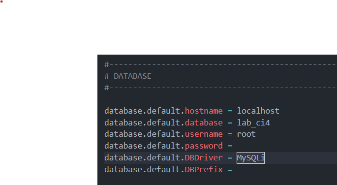

# Praktikum 12: Framework Lanjutan (CRUD)

## Membuat Database: Studi Kasus Data Artikel

## <u>Membuat Database</u>

`CREATE DATABASE lab_ci4;`

## <u>Membuat Tabel</u>

``
CREATE TABLE artikel (
id INT(11) auto_increment,
judul VARCHAR(200) NOT NULL,
isi TEXT,
gambar VARCHAR(200),
status TINYINT(1) DEFAULT 0,
slug VARCHAR(200),
PRIMARY KEY(id)
);
``

## Konfigurasi koneksi database
Selanjutnya membuat konfigurasi untuk menghubungkan dengan database server.
Konfigurasi dapat dilakukan dengan du acara, yaitu pada file **app/config/database.php**
atau menggunakan file **.env**. Pada praktikum ini kita gunakan konfigurasi pada file .env.



## Membuat Model
Selanjutnya adalah membuat Model untuk memproses data Artikel. Buat file baru pada
direktori **app/Models** dengan nama **ArtikelModel.php**

```php
<?php
namespace App\Models;
use CodeIgniter\Model;
class ArtikelModel extends Model
{
protected $table = 'artikel';
protected $primaryKey = 'id';
protected $useAutoIncrement = true;
protected $allowedFields = ['judul', 'isi', 'status', 'slug', 'gambar'];
}
```

